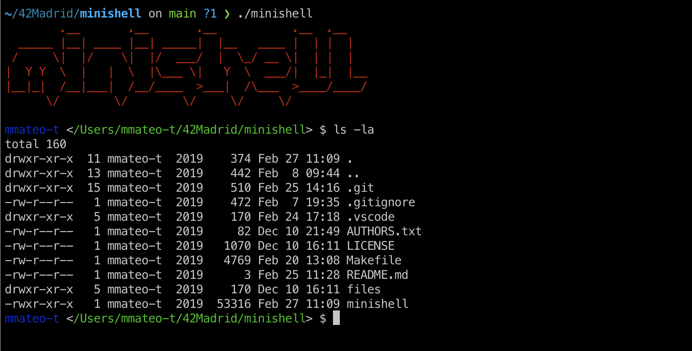

# 🐚 Minishell

> As beautiful as a shell
## 🆎 About
The objective of this project is for you to create a simple shell. Yes, your little bash or zsh. You will learn a lot about processes and file descriptors.
## 👣 A brief introduction
The existence of shells is linked to the very existence of IT. At the time, all coders agreed that communicating with a computer using aligned 1/0 switches was seriously irritating. It was only logical that they came up with the idea to communicate with
a computer using interactive lines of commands in a language somewhat close to english.
With Minishell, you’ll be able to travel through time and come back to problems people faced when Windows didn’t exist.
## 🧰 Installation & Usage
### 📑 Requirements
The only requirements are:
- GNU make (v3.81)
- Clang version 11.0.0
- Readline: stable 8.1.2

Those versions are the ones used during development.

### 🔧 Building the program

1. Download/Clone this repo

	`git clone git@github.com:MikelTolino/minishell.git`

2. `cd` into the root directory and run `make`

        cd minishell
        make

### 🏃 Running the program

After building the source, run `./minishell` from the project root.

## 📖 Main Project Instructions

- Show a prompt when waiting for a new command.
- Have a working History.
- Search and launch the right executable (based on the PATH variable or by using relative or absolute path)
- Environment variables ($ followed by characters) expand to their values.
### Builtins:
- **echo** with option -n
- **cd** with only a relative or absolute path
- **pwd** with no options
- **export** with no options
- **unset** with no options
- **env** with no options or arguments
- **exit** with no options
### Quoting
- **’** inhibit all interpretation of a sequence of characters.
- **"** inhibit all interpretation of a sequence of characters except for $.
### Redirections:
- **'<'** redirect input.
- **'>'** redirect output.
- **“<<”** read input from the current source until a line containing only the delimiter is seen.
- **“>>”** redirect output with append mode.
### Pipes
- **Pipes |** The output of each command in the pipeline is connected via a pipe to the input of the next command.
- **$?** expand to the exit status of the most recently executed foreground pipeline.
### Signals (Work like in bash)
- **ctrl-C**
- **ctrl-D**
- **ctrl-\\**

## 🔗 Links
- [Bash](https://www.gnu.org/savannah-checkouts/gnu/bash/manual/)
- [Create your own shell](https://www.geeksforgeeks.org/making-linux-shell-c/)
- [Writing your own shell](https://www.cs.purdue.edu/homes/grr/SystemsProgrammingBook/Book/Chapter5-WritingYourOwnShell.pdf)
